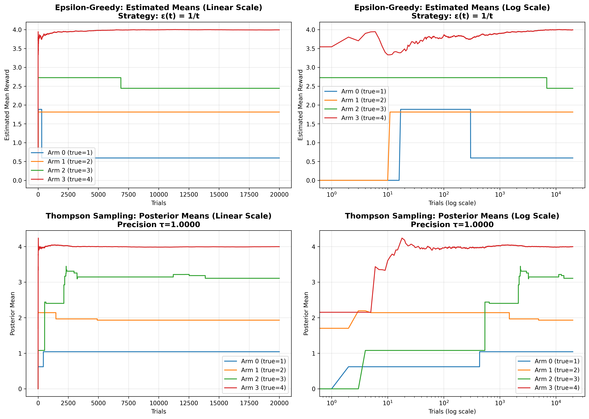
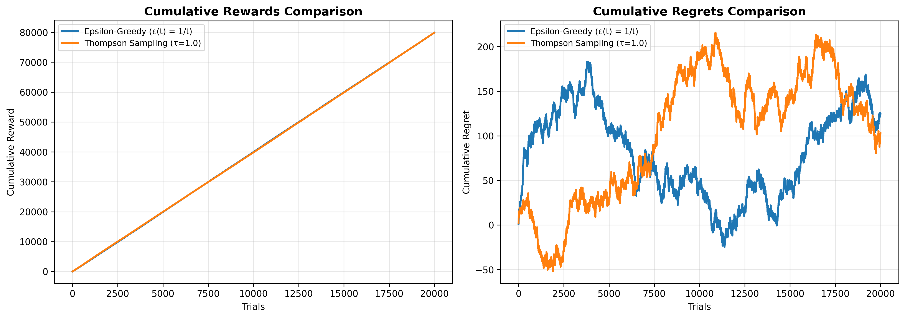
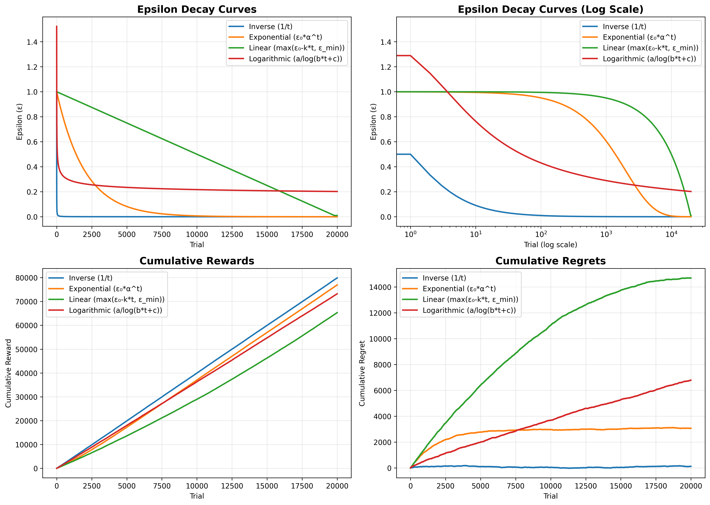
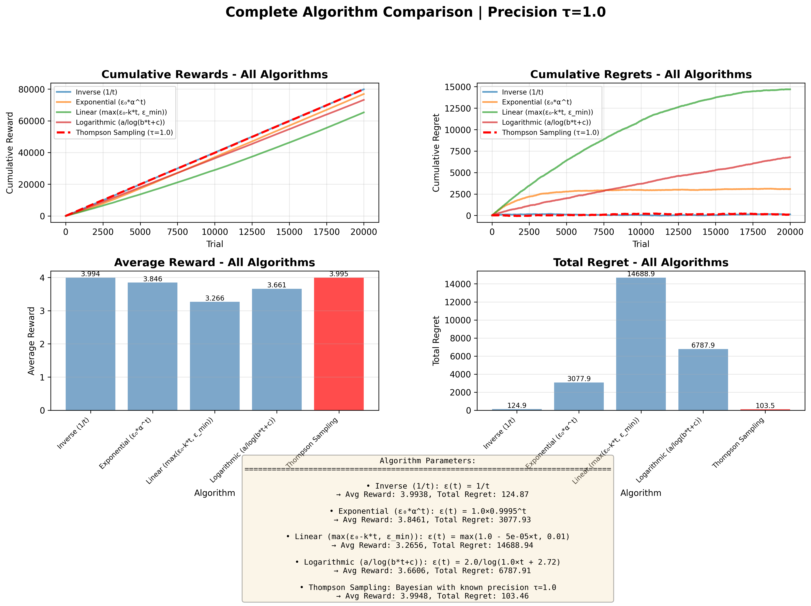

# Multi-Armed Bandit Experiment results

## plot1 (learning curves)

* **Epsilon-Greedy (linear x):**
  Each arm settles near their true values. Arm 3 and Arm 1 are very close, while Arm 2 and Arm 0 are slightly lower. But this doesn’t matter much, since the algorithm has been able to find the true good arm — Arm 3.

* **Epsilon-Greedy (log x):**
  Zooms the early rounds; we can see quick identification of the best arm and how soon exploration tails off as ε(t)=1/t shrinks.

* **Thompson Sampling (linear x):**
  Posterior means jump toward the truth very fast, with the best arm dominating early and only minor adjustments later. This shows Thompson Sampling's efficient exploration via posterior sampling.

* **Thompson Sampling (log x):**
  Thompson Sampling explores briefly, then locks onto the best arm quickly. Small wiggles reflect Bayesian updates from occasional re-checks of other arms.

## plot2 (cumulative rewards)

* **Cumulative Rewards**

  The two lines overlap almost perfectly, showing both methods spend most pulls on the best arm (μ=4) after a short warm-up.

* **Cumulative Regrets (expected)**

  Lower is better; both stay low and wiggle due to stochastic rewards being compared to a fixed “optimal” expectation. The small oscillations mean each method occasionally over/under-performs the expected best by chance.

## plot3 (bonus - trying different epsilon decay functions)

We see that for our scenario, 1/t decay function shows the best results, outperforming all the other examples I have included from our slides. It has the most cumulative rewards, while having least cumulative regrets.

## plot4 (bonus - comparing different versions against Thompson Sampling)

We again see how Thompson Sampling outperforms almost all the other versions compared here and only the version with 1/t decay comes close to Thompson Sampling.

* **Conclusion**

  Both methods ultimately identify the optimal arm, but Thompson Sampling learns slightly faster and with smoother adaptation due to its probabilistic exploration.

* **Bonus — Better Implementation Plan**

  1. We can try out different epsilon values.

  2. We can try experimenting with different **epsilon decay schedules** beyond the basic 1/t rule:

  * ε(t) = ε₀ * αᵗ
  * ε(t) = max(ε₀ − k·t, ε_min)
  * ε(t) = a / log(b·t + c)

  We can sweep over parameters (ε₀, α, k, ε_min, a, b, c) to see how exploration changes over time and how it affects performance.

  3. For **Thompson Sampling**, experiment with different **likelihood precision** (τ) values, such as 0.25, 0.5, 1, 2, and 4, and optionally adjust the prior strength.

  Evaluate each configuration using multiple random seeds and report:

  * Mean ± confidence interval of cumulative regret

  * Percentage of pulls of the best arm

  * Time to dominance (how fast the best arm is consistently selected)

  4. For this experiment, 20000 iterations are overkill, we could add some methods for early stopping since early on we can already tell which bandit is the best.
